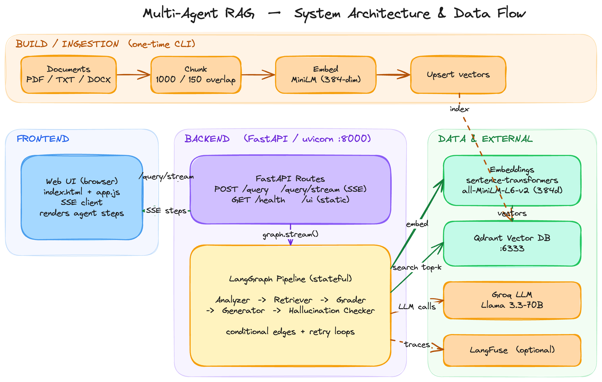
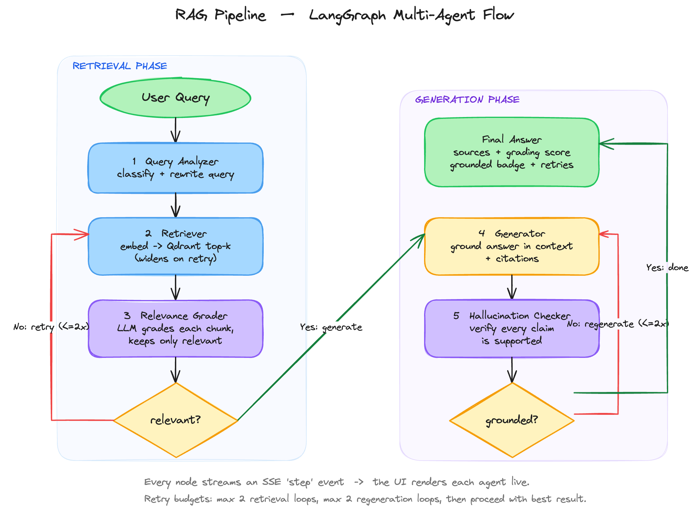

# Multi-Agent RAG Research Assistant

A production-style **Retrieval-Augmented Generation (RAG)** service built on
**LangGraph**. Instead of a single retrieve-then-generate call, the system runs a
pipeline of five specialised agents connected by conditional edges and bounded
retry loops. It grades retrieved context for relevance *before* generating, and
verifies the generated answer is grounded in that context *after* generating —
so the model is far less likely to return unsupported claims.

A FastAPI backend exposes the pipeline over HTTP and serves a lightweight web UI
that streams each agent's progress live over Server-Sent Events (SSE).

---

## Table of Contents

- [Overview](#overview)
- [Architecture](#architecture)
- [The Agent Pipeline](#the-agent-pipeline)
- [Features](#features)
- [Technology Stack](#technology-stack)
- [Project Structure](#project-structure)
- [Quick Start](#quick-start)
- [Running the Components](#running-the-components)
- [The Web UI](#the-web-ui)
- [API Reference](#api-reference)
- [Configuration](#configuration)
- [Deployment](#deployment)
- [Observability](#observability)
- [Testing](#testing)
- [Troubleshooting](#troubleshooting)
- [License](#license)

---

## Overview

The project has three moving parts that work together:

| Component | Role | Port |
|---|---|---|
| **Qdrant** | Vector database. Stores document chunks as embeddings so they can be searched by meaning rather than keywords. | `6333` |
| **FastAPI backend** | Runs the LangGraph agent pipeline, exposes the REST/SSE API, and serves the static web UI. | `8000` |
| **Web UI** | Static page served by the backend. Sends a question and renders each agent's step as it streams back. | served at `/ui/` |

There are only **two processes to run**: Qdrant (in Docker) and the backend
(Uvicorn). The UI is not a separate server — the backend serves it.

The lifecycle is split into two phases:

1. **Ingestion (one-time).** A CLI reads PDF/TXT/DOCX files, splits them into
   overlapping chunks, embeds each chunk, and upserts the vectors into Qdrant.
2. **Querying (per request).** A question is threaded through the five-agent
   graph, which retrieves, grades, generates, and verifies before returning a
   grounded answer with citations.

---

## Architecture



The diagram above maps the full system from build time to request time.

**Build / ingestion (top row, run once).**
`Documents (PDF/TXT/DOCX) -> Chunk (1000 chars, 150 overlap) -> Embed
(all-MiniLM-L6-v2, 384-dim) -> Upsert vectors` into the Qdrant collection. This
is the one-time indexing step performed by the ingestion CLI.

**Frontend.**
The browser UI (`index.html` + `app.js`) issues `POST /query/stream` and reads
the SSE response, rendering each agent step as it arrives.

**Backend (FastAPI / Uvicorn on `:8000`).**
The route layer exposes `POST /query`, `POST /query/stream` (SSE), `GET /health`,
and mounts the static UI at `/ui`. Each request invokes the **LangGraph
pipeline** — a stateful graph whose nodes are the five agents, wired with
conditional edges and bounded retry loops.

**Data and external services.**
- **Embeddings** (Sentence-Transformers, local) turn text into 384-dimensional
  vectors for both ingestion and query time.
- **Qdrant** stores those vectors and answers nearest-neighbour searches.
- **Groq** provides the LLM (Llama 3.3-70B) used by the analyzer, grader,
  generator, and hallucination checker.
- **LangFuse** (optional) receives a trace of every node for observability.

The dashed return arrow (`SSE steps`) is the live stream of per-node events the
backend pushes back to the browser.

---

## The Agent Pipeline



The pipeline is a **stateful LangGraph graph**. Every agent is a node; the
conditional edges decide whether to advance, retry retrieval, or regenerate. It
divides naturally into a retrieval phase and a generation phase.

| Step | Agent | File | Responsibility |
|---|---|---|---|
| 1 | **Query Analyzer** | [app/agents/query_analyzer.py](app/agents/query_analyzer.py) | Classifies the question and rewrites it into an optimised search query. |
| 2 | **Retriever** | [app/agents/retriever.py](app/agents/retriever.py) | Embeds the query and pulls the top-k most similar chunks from Qdrant. Widens `top_k` on each retry. |
| 3 | **Relevance Grader** | [app/agents/grader.py](app/agents/grader.py) | Asks the LLM to judge each chunk, keeps only relevant ones, and computes a relevance score. |
| 4 | **Generator** | [app/agents/generator.py](app/agents/generator.py) | Writes an answer grounded only in the graded context, with inline citations. |
| 5 | **Hallucination Checker** | [app/agents/hallucination_checker.py](app/agents/hallucination_checker.py) | Verifies every claim in the answer is supported by the context. |

**Conditional logic and retry loops** (defined in
[app/graph/pipeline.py](app/graph/pipeline.py)):

- After grading, if **no chunks are relevant**, the graph loops back to the
  Retriever and widens the search — up to `MAX_RETRIEVAL_RETRIES` times, then
  proceeds with the best available context.
- After the hallucination check, if the answer is **not grounded**, the graph
  loops back to the Generator — up to `MAX_GENERATION_RETRIES` times, then
  returns the best available answer.

Each loop is bounded, so the graph always terminates instead of looping forever.
Every node also emits an SSE `step` event, which is what the UI renders live.

---

## Features

- Multi-agent LangGraph pipeline with conditional edges and bounded retry loops.
- Live streaming web UI that shows each agent's progress over Server-Sent Events.
- Relevance grading that filters irrelevant chunks before generation.
- Hallucination detection that verifies grounding before returning an answer.
- Optional LangFuse observability with full per-node tracing; gracefully skipped
  when keys are absent.
- Dense semantic retrieval over Qdrant using Sentence-Transformers.
- Fast LLM inference via Groq (Llama 3.3-70B by default).
- FastAPI backend exposing a JSON REST API, SSE streaming, and auto-generated
  OpenAPI docs at `/docs`.
- Document ingestion for PDF, TXT, and DOCX through a CLI script.
- Fully configurable model, embeddings, retry budgets, and collection via
  environment variables.

---

## Technology Stack

| Component | Technology |
|---|---|
| Agent orchestration | LangGraph |
| LLM | Groq — Llama 3.3-70B (`llama-3.3-70b-versatile`) |
| Embeddings | Sentence-Transformers (`all-MiniLM-L6-v2`, 384-dim) |
| Vector store | Qdrant (local via Docker) |
| Observability | LangFuse v3 (optional) |
| API framework | FastAPI + Uvicorn |
| Streaming | Server-Sent Events (SSE) |
| Web UI | Vanilla HTML, CSS, and JavaScript (no build step) |
| Document parsing | pdfplumber, python-docx |
| Language | Python 3.9+ |

---

## Project Structure

```
rag-research-assistant/
├── app/
│   ├── config.py                  # Central settings + cached Groq LLM factory
│   ├── main.py                    # FastAPI entrypoint; mounts the UI + CORS
│   ├── agents/                    # The five pipeline agents
│   │   ├── query_analyzer.py
│   │   ├── retriever.py
│   │   ├── grader.py
│   │   ├── generator.py
│   │   └── hallucination_checker.py
│   ├── schemas/models.py          # Request, response, grading, and analysis models
│   ├── graph/
│   │   ├── state.py               # GraphState (LangGraph TypedDict)
│   │   └── pipeline.py            # Node wiring, conditional edges, retry logic
│   ├── vectorstore/
│   │   ├── embeddings.py          # Sentence-Transformers wrapper
│   │   └── qdrant_client.py       # Qdrant collection management, upsert, search
│   ├── observability/
│   │   └── langfuse_tracer.py     # LangFuse client + LangChain callback handler
│   └── api/routes.py              # POST /query, POST /query/stream (SSE), GET /health
├── ui/                            # Static web UI served at /ui/
│   ├── index.html
│   ├── styles.css
│   └── app.js
├── ingest/
│   └── document_loader.py         # CLI: parse -> chunk -> embed -> upsert
├── docs/diagrams/                 # Architecture and pipeline diagrams (source + PNG)
├── sample_documents/              # Example PDF / TXT / DOCX to ingest and test
├── tests/test_pipeline.py         # Offline unit tests (routing + schemas)
├── Dockerfile                     # Single-container build (app + embedded Qdrant)
├── start.sh                       # Container entrypoint (Qdrant -> ingest -> Uvicorn)
├── render.yaml                    # Render Blueprint for one-click deploy
├── DEPLOY.md                      # Deployment guide (Render / Railway / Fly.io)
├── docker-compose.yml             # Qdrant service for local development
├── requirements.txt
└── README.md
```

---

## Quick Start

**Prerequisites:** Python 3.9+, Docker Desktop (running), and a free Groq API key
from <https://console.groq.com>.

### 1. Install dependencies

```bash
git clone <repository-url>
cd rag-research-assistant

python -m venv venv
source venv/bin/activate          # Windows: venv\Scripts\activate
pip install -r requirements.txt
```

### 2. Configure environment variables

```bash
cp .env.example .env
```

Edit `.env` and set at least your Groq key (LangFuse keys are optional):

```env
GROQ_API_KEY=your_groq_api_key
LANGFUSE_PUBLIC_KEY=your_langfuse_public_key      # optional
LANGFUSE_SECRET_KEY=your_langfuse_secret_key      # optional
LANGFUSE_HOST=https://cloud.langfuse.com          # optional
QDRANT_HOST=localhost
QDRANT_PORT=6333
COLLECTION_NAME=research_docs
```

### 3. Start Qdrant

```bash
docker compose up -d
curl http://localhost:6333/healthz      # -> "healthz check passed"
```

The Qdrant dashboard is available at <http://localhost:6333/dashboard>.

### 4. Ingest documents

```bash
python -m ingest.document_loader --path ./sample_documents/
```

> The first run downloads the embedding model (~90 MB), so it pauses briefly.
> You will see `Done. N chunks indexed.` when it completes.

### 5. Run the backend (which also serves the UI)

```bash
uvicorn app.main:app --reload
```

### 6. Open the UI

Navigate to <http://localhost:8000/ui/>, type a question (or click an example),
and watch the agents work step by step.

---

## Running the Components

A common point of confusion: there is **no separate server for the UI** — the
FastAPI backend serves it. So there are only two processes: Qdrant and the
backend.

| Component | How to start | Port |
|---|---|---|
| Qdrant (vector database) | `docker compose up -d` | `6333` REST, `6334` gRPC |
| Backend + UI | `uvicorn app.main:app --reload` | `8000` |
| Web UI | open `http://localhost:8000/ui/` | — |

Useful commands:

```bash
# Qdrant
docker compose up -d        # start
docker compose ps           # status
docker compose logs -f      # logs
docker compose down         # remove container (keeps the data volume)
docker compose down -v      # remove container AND wipe all ingested data

# Backend
uvicorn app.main:app --reload                       # dev (auto-reload)
uvicorn app.main:app --host 0.0.0.0 --port 8000     # expose on your network
lsof -ti:8000 | xargs kill                          # stop a background backend
```

Typical order of operations:

```bash
docker compose up -d                                          # 1. start Qdrant
python -m ingest.document_loader --path ./sample_documents/   # 2. load data (once)
uvicorn app.main:app --reload                                 # 3. start backend + UI
# 4. open http://localhost:8000/ui/
```

Ingestion and querying must use the same `COLLECTION_NAME` (default
`research_docs`). They do by default, since both read
[app/config.py](app/config.py).

---

## The Web UI

Open <http://localhost:8000/ui/> and ask a question. As the pipeline runs, each
agent appears in a live timeline:

| Step | What it shows |
|---|---|
| Query Analyzer | The rewritten search query, query type, and any sub-questions. |
| Retriever | How many chunks were pulled (and on which attempt), with snippets and scores. |
| Relevance Grader | How many chunks were kept, the relevance score, and the surviving chunks. |
| Generator | The drafted answer, sources, and attempt number. |
| Hallucination Checker | The grounded / ungrounded verdict. |

A final answer panel shows the consolidated result with badges (grounded status,
relevance score, retry count). Retry loops appear naturally in the timeline — if
the graph re-retrieves or re-generates, those nodes show up again.

**How it streams.** The UI calls `POST /query/stream`, and the backend uses
LangGraph's `graph.stream(stream_mode="updates")` to emit an SSE event after each
node finishes. Because SSE-over-POST cannot use the browser's `EventSource`,
[ui/app.js](ui/app.js) reads the `fetch` response body stream and parses the SSE
frames manually.

> To see the retry loop fire, ask an off-topic question. The grader rejects the
> irrelevant chunks, and the graph retries retrieval up to two times before
> proceeding.

---

## API Reference

### `POST /query` — non-streaming

```bash
curl -X POST http://localhost:8000/query \
  -H "Content-Type: application/json" \
  -d '{"query": "What is retrieval-augmented generation?", "top_k": 5}'
```

| Field | Type | Default | Description |
|---|---|---|---|
| `query` | string | — | The natural-language question (required). |
| `top_k` | int | `5` | Number of chunks to retrieve (1–20). |

Response:

```json
{
  "answer": "Retrieval-Augmented Generation (RAG) is...",
  "sources": ["introduction_to_rag.txt", "transformer_architecture.pdf, page 1"],
  "grading_score": 0.8,
  "hallucination_check": "grounded",
  "retry_count": 0
}
```

| Field | Description |
|---|---|
| `answer` | The generated, context-grounded answer. |
| `sources` | De-duplicated citations backing the answer. |
| `grading_score` | Fraction of retrieved chunks judged relevant (0–1). |
| `hallucination_check` | `grounded` or `ungrounded`. |
| `retry_count` | Total extra loops taken (retrieval + generation). |

### `POST /query/stream` — streaming (SSE)

Same request body as `/query`, but the response is a `text/event-stream` of
events: `start` (run began), `step` (one per node execution), `done` (final
consolidated result), and `error` (something failed). This is what the web UI
consumes.

```bash
curl -N -X POST http://localhost:8000/query/stream \
  -H "Content-Type: application/json" \
  -d '{"query": "How does self-attention work?", "top_k": 4}'
```

### Other endpoints

| Endpoint | Description |
|---|---|
| `GET /health` | Liveness probe. Returns `{"status": "ok"}`. |
| `GET /` | JSON banner with links to the UI and docs. |
| `GET /docs` | Interactive Swagger UI. |
| `GET /ui/` | The streaming web UI. |

---

## Configuration

All settings are read from the environment (via `.env`) in
[app/config.py](app/config.py).

| Variable | Default | Description |
|---|---|---|
| `GROQ_API_KEY` | — | **Required.** Groq API key for the LLM. |
| `LLM_MODEL` | `llama-3.3-70b-versatile` | Groq chat model id. |
| `LLM_TEMPERATURE` | `0` | Base sampling temperature. |
| `EMBEDDING_MODEL` | `all-MiniLM-L6-v2` | Sentence-Transformers model. |
| `QDRANT_HOST` | `localhost` | Qdrant host. |
| `QDRANT_PORT` | `6333` | Qdrant REST port. |
| `COLLECTION_NAME` | `research_docs` | Qdrant collection name. |
| `LANGFUSE_PUBLIC_KEY` | — | LangFuse public key (optional). |
| `LANGFUSE_SECRET_KEY` | — | LangFuse secret key (optional). |
| `LANGFUSE_HOST` | `https://cloud.langfuse.com` | LangFuse host (`LANGFUSE_BASE_URL` also accepted). |
| `MAX_RETRIEVAL_RETRIES` | `2` | Max retrieval retry loops on irrelevant context. |
| `MAX_GENERATION_RETRIES` | `2` | Max regeneration loops on ungrounded answers. |

---

## Deployment

This application is **not suitable for serverless platforms such as Vercel**: it
loads PyTorch and Sentence-Transformers (well over typical serverless function
size limits) and requires a long-lived Qdrant vector store. It deploys cleanly to
any container platform instead.

A single-container setup is included — the [Dockerfile](Dockerfile) runs the
FastAPI app and an embedded Qdrant server together, ingesting the sample
documents on first boot via [start.sh](start.sh). A [render.yaml](render.yaml)
Blueprint enables a near one-click deploy on Render.

See **[DEPLOY.md](DEPLOY.md)** for step-by-step instructions for Render, Railway,
and Fly.io, including how to add a persistent disk and a local container test.

---

## Observability

When LangFuse keys are set, every run is traced through the LangChain callback
handler (see [app/observability/langfuse_tracer.py](app/observability/langfuse_tracer.py)):

- Node-level latency, to identify the slowest agent.
- Token usage per node, to track cost across Retriever, Generator, and Checker.
- Retry tracking, to monitor how often the graph loops back.
- A full trace tree: analyzer → retriever → grader → generator → checker.

If the keys are absent, tracing is silently skipped and the pipeline runs
unchanged.

---

## Testing

The test suite mocks all network, LLM, and vector-store calls, so it runs fully
offline:

```bash
python -m unittest tests.test_pipeline -v
# or, if pytest is installed:
pytest -v
```

It covers the graph routing decisions (retry vs. proceed) and the core Pydantic
schemas.

---

## Troubleshooting

| Symptom | Fix |
|---|---|
| UI loads but queries hang or fail | Ensure the backend (`uvicorn ...`) and Qdrant (`docker compose ps`) are both running. |
| `Connection refused` to `:6333` | Qdrant is not running — `docker compose up -d`. |
| Empty or "no context" answers | Nothing has been ingested into `COLLECTION_NAME` — run the ingest step. |
| First query or ingest is very slow | The embedding model (~90 MB) downloads once on first use; later runs are fast. |
| `GROQ_API_KEY` errors / 401 | Set a valid key in `.env` and restart the backend. |
| Qdrant client/server version warning | Harmless; optionally `pip install -U qdrant-client` to match the server. |
| Port 8000 already in use | `lsof -ti:8000 \| xargs kill`, then restart. |

---

## License

MIT License — free to use and modify.

## Author

**Jasmin Bheda** · [LinkedIn](https://www.linkedin.com/in/jasmin-bheda/) ·
[GitHub](https://github.com/travizjass)
